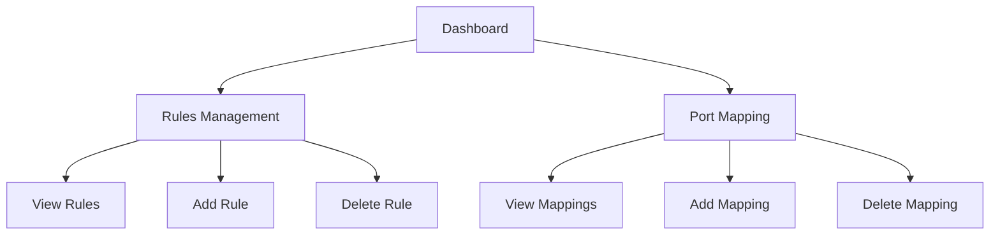

## 1. Product Overview
Linux防火墙管理应用，用于可视化管理iptables和firewalld规则
- 提供直观的界面管理Linux防火墙规则，简化复杂的命令行操作
- 目标用户为系统管理员和需要管理服务器防火墙的技术人员

## 2. Core Features

### 2.1 User Roles
| Role | Registration Method | Core Permissions |
|------|---------------------|------------------|
| Admin | Local access only | Full firewall management permissions |

### 2.2 Feature Module
1. **Dashboard**: firewall status overview, quick access to main functions
2. **Rules Management**: add/delete security policies, view existing rules
3. **Port Mapping**: add/delete port forwarding rules

### 2.3 Page Details
| Page Name | Module Name | Feature description |
|-----------|-------------|---------------------|
| Dashboard | Status Overview | Display current firewall status, active rules count, system information |
| Dashboard | Quick Actions | One-click access to common operations like restarting firewall, flushing rules |
| Rules Management | Rule List | Display all existing firewall rules with details (protocol, port, action, etc.) |
| Rules Management | Add Rule | Form to create new firewall rules with various parameters |
| Rules Management | Delete Rule | Option to remove existing rules |
| Port Mapping | Mapping List | Display current port forwarding rules |
| Port Mapping | Add Mapping | Form to create new port forwarding rules |
| Port Mapping | Delete Mapping | Option to remove existing port forwarding rules |

## 3. Core Process
1. User accesses the dashboard to view firewall status
2. User navigates to Rules Management to view, add, or delete security policies
3. User navigates to Port Mapping to configure port forwarding
4. All changes are applied to the underlying iptables/firewalld system

## 4. User Interface Design
### 4.1 Design Style
- Primary color: #3b82f6 (blue)
- Secondary color: #10b981 (green)
- Button style: Rounded corners, subtle shadow
- Font: Inter, sans-serif
- Layout style: Card-based with sidebar navigation
- Icon style: Lucide icons, clean and minimal

### 4.2 Page Design Overview
| Page Name | Module Name | UI Elements |
|-----------|-------------|-------------|
| Dashboard | Status Overview | Card with status indicators, progress bars for rule count, system info table |
| Rules Management | Rule List | Table with sortable columns, search functionality, pagination |
| Rules Management | Add Rule | Form with dropdowns for protocol, action, input fields for ports, IPs |
| Port Mapping | Mapping List | Table displaying source/destination ports and IPs |
| Port Mapping | Add Mapping | Form with input fields for source/destination details |

### 4.3 Responsiveness
- Desktop-first design
- Mobile-adaptive layout with collapsed sidebar
- Touch optimization for mobile devices

### 4.4 3D Scene Guidance
- Not applicable for this project