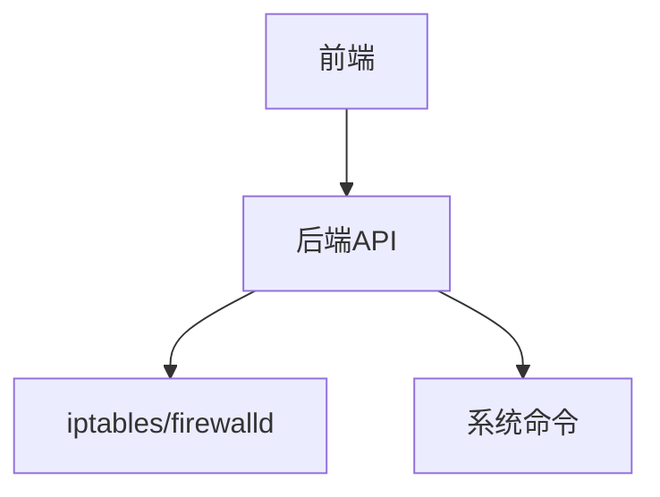
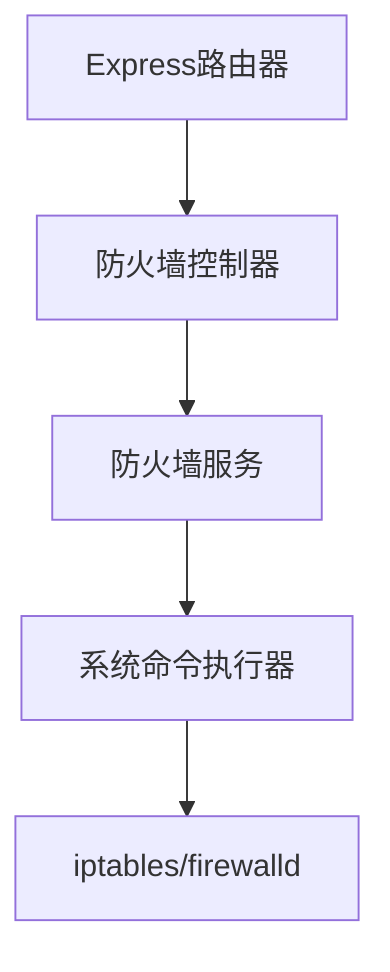

## 1. 架构设计

## 2. 技术描述
- 前端: React@18 + TypeScript + TailwindCSS@3 + Vite
- 初始化工具: vite-init
- 后端: Express@4 + TypeScript
- 数据库: 无 (使用系统文件和命令)

## 3. 路由定义
| 路由 | 用途 |
|------|------|
| / | 仪表板，显示防火墙状态概览 |
| /rules | 规则管理页面 |
| /port-mapping | 端口转发配置页面 |

## 4. API定义
### 4.1 防火墙状态API
- **GET /api/firewall/status**
  - 响应: `{ status: string, activeRules: number, firewallType: string }`

### 4.2 规则管理API
- **GET /api/rules**
  - 响应: `Array<{ id: string, protocol: string, port: number, action: string, source: string, destination: string }>`
- **POST /api/rules**
  - 请求: `{ protocol: string, port: number, action: string, source: string, destination: string }`
  - 响应: `{ success: boolean, message: string }`
- **DELETE /api/rules/:id**
  - 响应: `{ success: boolean, message: string }`

### 4.3 端口映射API
- **GET /api/port-mapping**
  - 响应: `Array<{ id: string, sourcePort: number, destinationPort: number, destinationIP: string }>`
- **POST /api/port-mapping**
  - 请求: `{ sourcePort: number, destinationPort: number, destinationIP: string }`
  - 响应: `{ success: boolean, message: string }`
- **DELETE /api/port-mapping/:id**
  - 响应: `{ success: boolean, message: string }`

## 5. 服务器架构图

## 6. 数据模型
### 6.1 数据模型定义
- 不需要数据库，使用系统命令和文件

### 6.2 数据定义语言
- 不适用，使用系统级配置